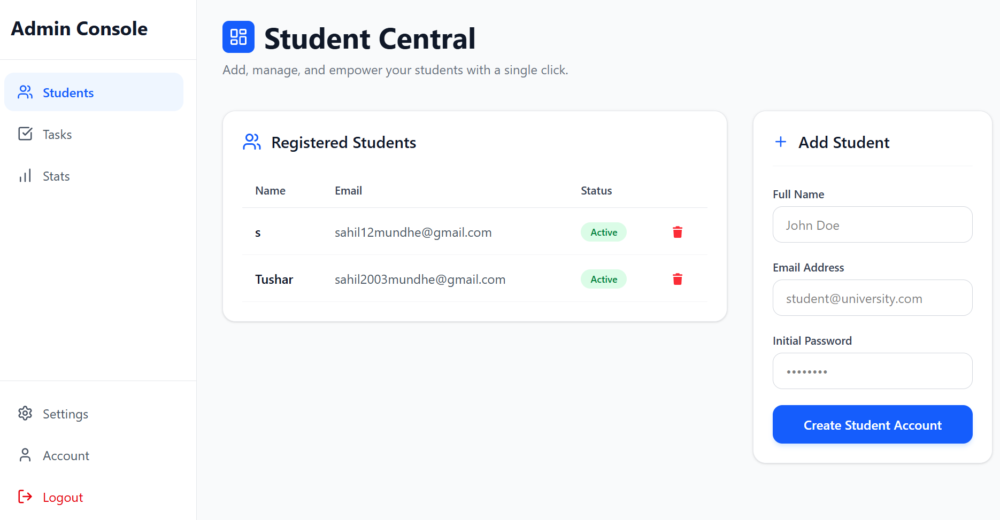
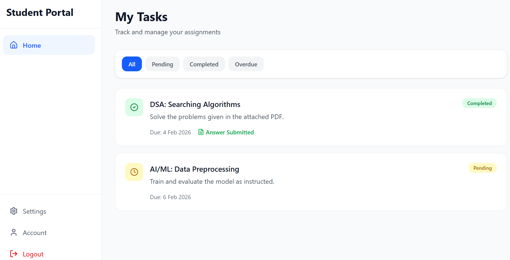
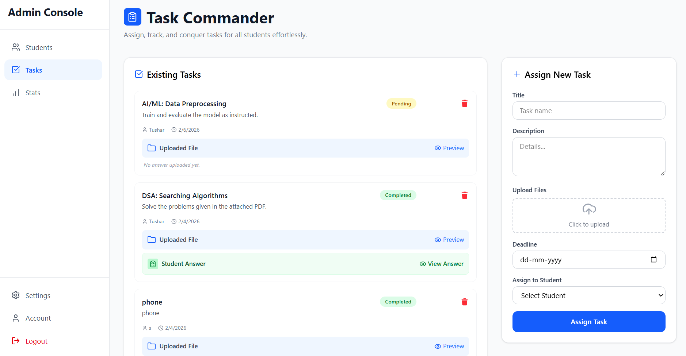
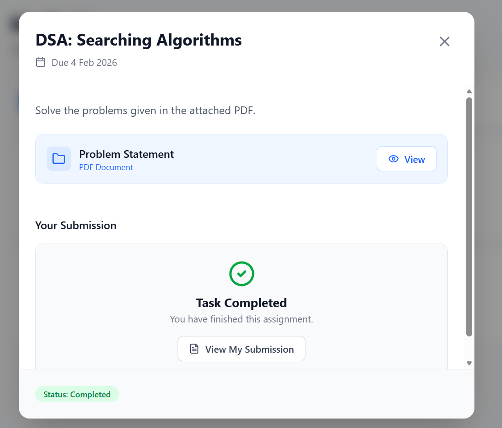

# SyncEdu - Student Management & Assignment Portal


SyncEdu is a comprehensive Learning Management System (LMS) designed to bridge the communication gap between Administrators and Students. It features a secure, role-based architecture allowing admins to assign PDF-based tasks and students to submit solutions, with real-time status tracking and email notifications.

---

## 🚀 Key Features

### 👨‍💼 Admin Module
- **Dashboard Analytics:** Visual breakdown of task completion rates using interactive charts.
- **Task Management:** Create, update, and delete assignments with deadline enforcement.
- **PDF Question Uploads:** Integrated with **Cloudinary** for persistent, secure PDF hosting.
- **Student Management:** Register students and automatically send login credentials via email.
- **Submission Review:** View student submission status (Pending, Completed, Overdue) and download answer scripts.

### 👨‍🎓 Student Module
- **Personalized Dashboard:** View assigned tasks sorted by priority and deadline.
- **File Submission:** Upload answer PDFs directly to cloud storage.
- **Status Tracking:** Real-time updates on task status (e.g., auto-marking "Overdue" if the deadline passes).
- **Secure Access:** JWT-based authentication ensures data privacy.

---
## 📸 Screenshots

### 1. Admin Dashboard
*Overview of tasks and analytics.*


### 2. Student Dashboard
*Student view for tracking assignments.*


### 3. Task Creation
*Admin interface for creating and assigning PDF tasks.*


### 4. Answer Upload
*Student interface for uploading answer PDFs.*



## 🛠️ Technical Architecture

This project follows a **Monolithic MVC Architecture** with a decoupled frontend and backend.

### **Frontend**
- **Framework:** React.js (Vite) + TypeScript
- **Styling:** Tailwind CSS + Lucide React (Icons)
- **State Management:** React Hooks (`useState`, `useEffect`)
- **HTTP Client:** Axios (with interceptors for JWT handling)

### **Backend**
- **Runtime:** Node.js & Express.js
- **Database:** MongoDB (Mongoose ODM) for flexible schema modeling.
- **Authentication:** JWT (JSON Web Tokens) & BcryptJS for password hashing.
- **File Storage:** **Cloudinary** (switched from local disk storage to ensure persistence on cloud deployments like Render/Vercel).
- **Email Service:** Nodemailer (Gmail SMTP) for automated notifications.

---

## 📂 Project Structure

```text
StudentManagement/
├── backend/
│   ├── utils/            
│   ├── cloudinaryConfig.js 
│   └── app.js            
│
└── frontend/
    └── src/
        ├── components/
        │   └── layout/   
        ├── context/      
        ├── lib/          
        ├── pages/
        │   ├── Admin/    
        │   ├── Student/  
        │   └── superadmin/ 
        ├── App.css
        ├── App.tsx       
        ├── index.css
        └── main.tsx      

## ⚙️ Installation & Setup

### Prerequisites
- Node.js (v16+)
- MongoDB (Local or Atlas)
- Cloudinary Account
- Gmail Account (SMTP)


1. Clone the Repository
Bash
git clone [https://github.com/Sahileweb/SyncEdu.git](https://github.com/Sahileweb/SyncEdu.git)
cd SyncEdu

2. Backend Setup
Bash
cd backend
npm install
Create a .env file in the backend folder:

Code snippet
PORT=5000
MONGO_URL=your_mongodb_connection_string
JWT_SECRET=your_super_secret_key
# Cloudinary Config
CLOUDINARY_CLOUD_NAME=your_cloud_name
CLOUDINARY_API_KEY=your_api_key
CLOUDINARY_API_SECRET=your_api_secret
# Email Config
EMAIL_USER=your_email@gmail.com
EMAIL_PASS=your_app_password
Start the server:

Bash
npm run dev
3. Frontend Setup
Open a new terminal:

Bash
cd frontend
npm install
npm run dev
🧠 Developer Decisions & Trade-offs
Why Cloudinary over Local Storage?
Initially, the project used multer.diskStorage to save files locally. However, when deploying to ephemeral cloud platforms (like Render or Vercel), the local filesystem is wiped on every restart, causing data loss. I migrated to Cloudinary to ensure persistent, reliable storage for PDF documents regardless of the hosting environment.

Why TypeScript?
Adopting TypeScript in the frontend drastically reduced runtime errors by enforcing strict typing on API responses (e.g., Task and Student interfaces), ensuring that the UI always receives the expected data structure.

🛡️ Security Best Practices implemented
Password Hashing: All passwords are hashed using bcryptjs before storage.

Auth Middleware: Protected routes verify JWT tokens on every request.

Role-Based Access Control (RBAC): Middleware specifically separates isAdmin and isStudent access levels.

Environment Variables: Sensitive keys (API secrets, DB URI) are never hardcoded.

🤝 Contributing
Contributions are welcome! Please fork the repository and create a pull request for any feature enhancements.

📄 License
This project is licensed under the MIT License.

